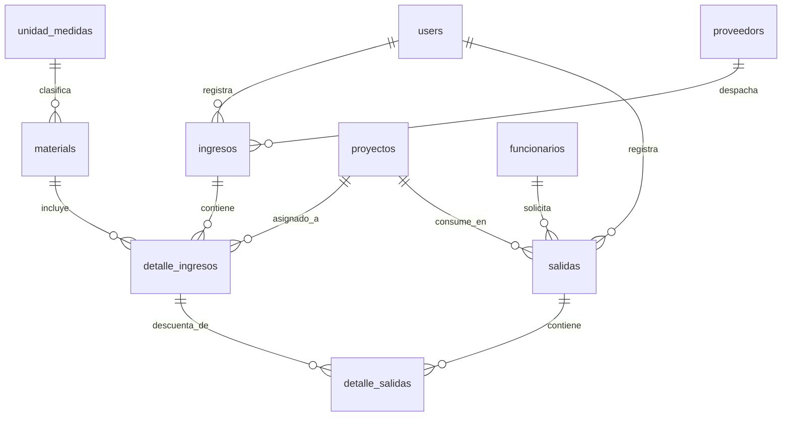

# Diseño del Modelo de Base de Datos (Fase 2)
## Proyecto: Sistema de Control de Materiales e Inventarios (Asphalt-AGY)

Este documento contiene la arquitectura de la base de datos MySQL, el diccionario de datos detallado y las relaciones relacionales de las tablas para el control de inventario PEPS físico por proyecto.

---

## 1. Diagrama de Relaciones (Estructura de Tablas)

El modelo consta de 10 tablas interconectadas para garantizar la integridad referencial y permitir el rastreo cronológico exacto de lotes.

---

## 2. Diccionario de Datos Detallado

### 2.1. Tabla: `users` (Usuarios del Sistema)
Almacena las credenciales y los roles del personal autorizado para acceder a la aplicación.
| Campo | Tipo | Nulo | Llave | Predeterminado | Descripción |
| :--- | :--- | :--- | :--- | :--- | :--- |
| `id` | BIGINT UNSIGNED | No | PK | *Autoincrement* | Identificador único de usuario. |
| `name` | VARCHAR(155) | No | | | Nombre completo del usuario. |
| `username` | VARCHAR(50) | No | Unique | | Nombre de usuario único para login. |
| `password` | VARCHAR(255) | No | | | Contraseña encriptada con Bcrypt. |
| `role` | ENUM('administrador', 'operador', 'visor') | No | | | Rol de permisos asignado en el sistema. |
| `active` | TINYINT(1) | No | | 1 (True) | Estado de la cuenta (1: Activa, 0: Inactiva). |
| `created_at` | TIMESTAMP | Sí | | NULL | Fecha de creación del registro. |
| `updated_at` | TIMESTAMP | Sí | | NULL | Fecha de última modificación. |

### 2.2. Tabla: `unidad_medidas` (Unidades de Medida)
Define las unidades de medida físicas de los materiales (ej: metros cúbicos, kilogramos, litros).
| Campo | Tipo | Nulo | Llave | Predeterminado | Descripción |
| :--- | :--- | :--- | :--- | :--- | :--- |
| `id` | BIGINT UNSIGNED | No | PK | *Autoincrement* | Identificador de la unidad de medida. |
| `nombre` | VARCHAR(50) | No | | | Nombre de la unidad (ej: "Metros Cúbicos"). |
| `abreviacion` | VARCHAR(10) | No | | | Abreviación física (ej: "m3", "Kg"). |
| `created_at` | TIMESTAMP | Sí | | NULL | Fecha de creación. |
| `updated_at` | TIMESTAMP | Sí | | NULL | Fecha de modificación. |

### 2.3. Tabla: `materials` (Catálogo de Materiales)
Catálogo general de materias primas configurado exclusivamente por el Administrador.
| Campo | Tipo | Nulo | Llave | Predeterminado | Descripción |
| :--- | :--- | :--- | :--- | :--- | :--- |
| `id` | BIGINT UNSIGNED | No | PK | *Autoincrement* | Identificador único del material. |
| `nombre` | VARCHAR(100) | No | | | Nombre descriptivo (ej: "Grava 3/4"). |
| `descripcion` | TEXT | Sí | | NULL | Descripción detallada del material. |
| `id_medida` | BIGINT UNSIGNED | No | FK | | Enlace a `unidad_medidas.id`. |
| `stock_minimo` | DECIMAL(12,2) | No | | 0.00 | Cantidad mínima para emitir alertas críticas. |
| `created_at` | TIMESTAMP | Sí | | NULL | Fecha de creación. |
| `updated_at` | TIMESTAMP | Sí | | NULL | Fecha de modificación. |

### 2.4. Tabla: `proveedors` (Proveedores)
Directorio de empresas proveedoras que suministran insumos a la planta.
| Campo | Tipo | Nulo | Llave | Predeterminado | Descripción |
| :--- | :--- | :--- | :--- | :--- | :--- |
| `id` | BIGINT UNSIGNED | No | PK | *Autoincrement* | Identificador del proveedor. |
| `razon_social` | VARCHAR(150) | No | | | Nombre legal de la empresa. |
| `nit` | VARCHAR(30) | Sí | Unique | NULL | Número de Identificación Tributaria. |
| `telefono` | VARCHAR(20) | Sí | | NULL | Teléfono de contacto. |
| `direccion` | VARCHAR(255) | Sí | | NULL | Dirección física del proveedor. |
| `created_at` | TIMESTAMP | Sí | | NULL | Fecha de creación. |
| `updated_at` | TIMESTAMP | Sí | | NULL | Fecha de modificación. |

### 2.5. Tabla: `proyectos` (Obras y Proyectos)
Proyectos viales autorizados para el consumo de materiales.
| Campo | Tipo | Nulo | Llave | Predeterminado | Descripción |
| :--- | :--- | :--- | :--- | :--- | :--- |
| `id` | BIGINT UNSIGNED | No | PK | *Autoincrement* | Identificador único del proyecto. |
| `nombre` | VARCHAR(150) | No | | | Nombre del proyecto (ej: "Renueva Vías Lote A"). |
| `ubicacion` | VARCHAR(255) | Sí | | NULL | Ubicación de la obra en El Alto. |
| `encargado` | VARCHAR(100) | Sí | | NULL | Nombre del Residente o Ingeniero de Obra. |
| `fecha_inicio` | DATE | Sí | | NULL | Fecha programada de inicio. |
| `fecha_fin` | DATE | Sí | | NULL | Fecha programada de conclusión. |
| `estado` | ENUM('activo', 'finalizado', 'pausado') | No | | 'activo' | Estado actual de la obra. |
| `created_at` | TIMESTAMP | Sí | | NULL | Fecha de creación. |
| `updated_at` | TIMESTAMP | Sí | | NULL | Fecha de modificación. |

### 2.6. Tabla: `funcionarios` (Funcionarios Receptor)
Lista del personal de obra autorizado para retirar y firmar vales de salida de materiales.
| Campo | Tipo | Nulo | Llave | Predeterminado | Descripción |
| :--- | :--- | :--- | :--- | :--- | :--- |
| `id` | BIGINT UNSIGNED | No | PK | *Autoincrement* | Identificador único del funcionario. |
| `nombre` | VARCHAR(150) | No | | | Nombre completo del funcionario. |
| `cargo` | VARCHAR(100) | Sí | | NULL | Cargo (ej: "Chofer de Volqueta", "Supervisor"). |
| `area` | VARCHAR(100) | Sí | | NULL | Área o unidad técnica (ej: "Mantenimiento Vial"). |
| `activo` | TINYINT(1) | No | | 1 (True) | Estado (1: Activo, 0: Inactivo). |
| `created_at` | TIMESTAMP | Sí | | NULL | Fecha de creación. |
| `updated_at` | TIMESTAMP | Sí | | NULL | Fecha de modificación. |

### 2.7. Tabla: `ingresos` (Cabecera de Adquisiciones)
Registro general de un envío recibido.
| Campo | Tipo | Nulo | Llave | Predeterminado | Descripción |
| :--- | :--- | :--- | :--- | :--- | :--- |
| `id` | BIGINT UNSIGNED | No | PK | *Autoincrement* | Identificador único del ingreso. |
| `nro_ticket` | VARCHAR(50) | Sí | | NULL | Nro de ticket de la balanza física de planta. |
| `odc` | VARCHAR(50) | Sí | | NULL | Orden de Compra/Contrato asociado. |
| `id_proveedor` | BIGINT UNSIGNED | Sí | FK | NULL | Enlace a `proveedors.id`. |
| `id_usuario` | BIGINT UNSIGNED | No | FK | | Enlace a `users.id` (quien registra). |
| `fecha_adquirida` | DATE | No | | | Fecha física de recepción del material. |
| `observaciones` | TEXT | Sí | | NULL | Notas adicionales de la entrega. |
| `created_at` | TIMESTAMP | Sí | | NULL | Fecha de creación. |
| `updated_at` | TIMESTAMP | Sí | | NULL | Fecha de modificación. |

### 2.8. Tabla: `detalle_ingresos` (Lotes PEPS por Proyecto)
Esta tabla controla el inventario físico disponible a nivel de **lotes por proyecto**, siendo la clave del algoritmo PEPS.
| Campo | Tipo | Nulo | Llave | Predeterminado | Descripción |
| :--- | :--- | :--- | :--- | :--- | :--- |
| `id` | BIGINT UNSIGNED | No | PK | *Autoincrement* | Identificador de lote. |
| `id_ingreso` | BIGINT UNSIGNED | No | FK | | Enlace a `ingresos.id` (ON DELETE CASCADE). |
| `id_material` | BIGINT UNSIGNED | No | FK | | Enlace a `materials.id`. |
| `id_proyecto` | BIGINT UNSIGNED | No | FK | | Enlace a `proyectos.id` (Asignación en ingreso). |
| `cantidad_adquirida` | DECIMAL(12,2) | No | | | Cantidad total física ingresada originalmente. |
| `cantidad_actual_lote` | DECIMAL(12,2) | No | | | **Saldo físico disponible actual** del lote. Se reduce a medida que se despacha. |
| `created_at` | TIMESTAMP | Sí | | NULL | Fecha de creación. |
| `updated_at` | TIMESTAMP | Sí | | NULL | Fecha de modificación. |

### 2.9. Tabla: `salidas` (Cabecera de Consumos)
Registro general de egreso o despacho de materiales.
| Campo | Tipo | Nulo | Llave | Predeterminado | Descripción |
| :--- | :--- | :--- | :--- | :--- | :--- |
| `id` | BIGINT UNSIGNED | No | PK | *Autoincrement* | Identificador del egreso. |
| `id_funcionario` | BIGINT UNSIGNED | No | FK | | Enlace a `funcionarios.id` (quien recibe). |
| `id_proyecto` | BIGINT UNSIGNED | No | FK | | Enlace a `proyectos.id` (proyecto que consume). |
| `id_usuario` | BIGINT UNSIGNED | No | FK | | Enlace a `users.id` (quien registra). |
| `uso` | VARCHAR(255) | Sí | | NULL | Descripción detallada de en qué se utilizará. |
| `fecha_salida` | DATE | No | | | Fecha física de despacho. |
| `created_at` | TIMESTAMP | Sí | | NULL | Fecha de creación. |
| `updated_at` | TIMESTAMP | Sí | | NULL | Fecha de modificación. |

### 2.10. Tabla: `detalle_salidas` (Detalle de Lotes Consumidos)
Registra de qué lotes de ingreso exactos se descontaron las cantidades de la salida.
| Campo | Tipo | Nulo | Llave | Predeterminado | Descripción |
| :--- | :--- | :--- | :--- | :--- | :--- |
| `id` | BIGINT UNSIGNED | No | PK | *Autoincrement* | Identificador único del detalle de salida. |
| `id_salida` | BIGINT UNSIGNED | No | FK | | Enlace a `salidas.id` (ON DELETE CASCADE). |
| `id_detalle_ingreso` | BIGINT UNSIGNED | No | FK | | Enlace a `detalle_ingresos.id` (Lote de origen). |
| `cantidad_salida` | DECIMAL(12,2) | No | | | Cantidad física descontada de este lote específico. |
| `created_at` | TIMESTAMP | Sí | | NULL | Fecha de creación. |
| `updated_at` | TIMESTAMP | Sí | | NULL | Fecha de modificación. |

---

## 3. Reglas de Integridad Referencial
1. **Eliminación en Cascada:** Al eliminar una cabecera de `ingreso` o `salida`, sus registros hijos en `detalle_ingresos` o `detalle_salidas` se eliminarán automáticamente para evitar huérfanos.
2. **Restricción de Borrado:** No se podrá eliminar un `material`, `proyecto`, `proveedor` o `funcionario` que ya tenga movimientos asociados en las tablas de detalle transaccional. Esto protege la consistencia histórica del Kardex físico ante auditorías gubernamentales.
