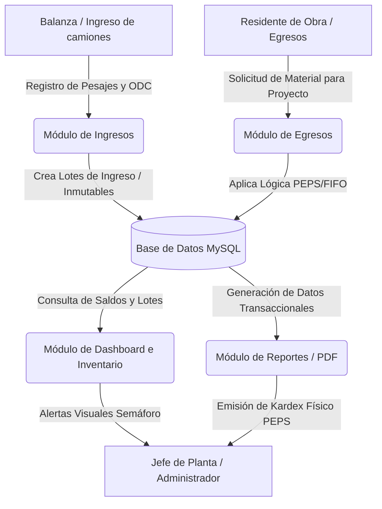
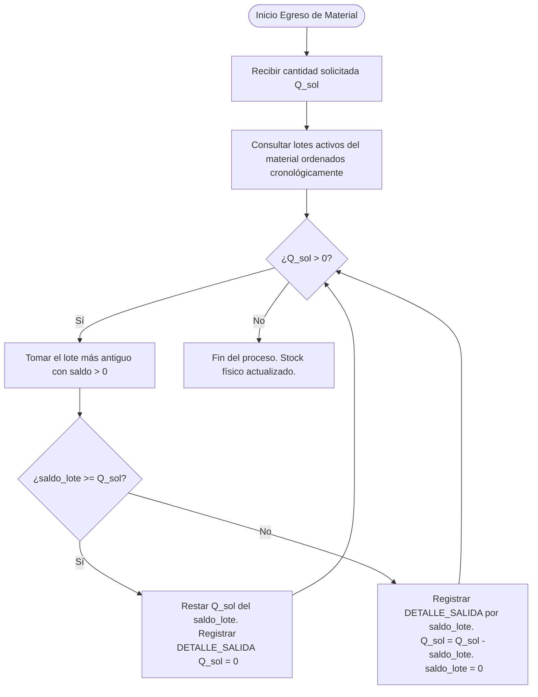

# CAPÍTULO 1: INTRODUCCIÓN Y ENTENDIMIENTO DEL NEGOCIO

## 1.1. Antecedentes del Problema

El Gobierno Autónomo Municipal de El Alto (GAMEA), a través de su Dirección de Obras Municipales y la Unidad de Mantenimiento y Bacheo, opera la Planta de Asfalto con el objetivo de producir mezcla asfáltica en caliente y frío para la ejecución de proyectos de pavimentación, bacheo y recapado vial en los catorce distritos de la urbe alteña. La correcta gestión de los materiales e insumos críticos en esta planta (tales como cemento asfáltico o bitumen, asfalto en frío, áridos, agregados, combustibles y aditivos) es un pilar fundamental para asegurar la continuidad de las obras viales y optimizar el uso de los recursos públicos.

Sin embargo, históricamente, el control de inventario de estos insumos se ha ejecutado de manera informal y descentralizada a través de herramientas ofimáticas genéricas (específicamente hojas de cálculo de Microsoft Excel) administradas localmente por el personal operativo de la planta. Esta metodología ha derivado en severas debilidades de control interno, falta de trazabilidad en tiempo real y discrepancias entre los ingresos registrados y los consumos reales aplicados en las obras.

Esta situación crítica fue evidenciada de manera formal mediante una auditoría interna in situ realizada el 6 de noviembre de 2024 por la Unidad de Auditoría Interna del GAMEA. Dicha inspección dio lugar a la emisión del **Informe de Auditoría Interna UAI/ACR/001/2025**, el cual expone en su sección 3.6 el *"Inadecuado registro de inventarios en la Planta de Asfalto del Gobierno Autónomo Municipal de El Alto"*. El informe de auditoría destaca los siguientes hallazgos técnico-administrativos:
1. **Ausencia de Registro Cronológico:** Las plantillas de Excel empleadas por el responsable de planta no exponen las fechas de ingreso, fechas de salida y los saldos actualizados cronológicamente para cada material, limitándose a presentar consolidados globales de compras anuales que no permiten verificar el flujo temporal físico del stock.
2. **Deficiencias en Conciliación de Saldos:** Como ejemplo, el informe de auditoría expuso balances del cemento asfáltico (compras de la gestión 2024) asociados a proyectos específicos, donde se identificaron saldos de materiales en planta acumulados bajo diferentes Órdenes de Compra (como las ODC ANPE/UACM/ODC/024/24 y ANPE/UACM/ODC/028/24) sin que existieran registros transaccionales detallados que validaran su uso secuencial o el estado actual de los lotes. Una situación análoga fue observada en el manejo del asfalto en frío (ej. ODC ANPE/UACM/ODC/018/24 y ANPE/UACM/ODC/179/24).
3. **Vulneración de Normativa Gubernamental:** Las omisiones en el control y la falta de registros sistemáticos de almacén vulneran directamente las siguientes disposiciones vigentes del Estado Plurinacional de Bolivia:
   * **Normas Básicas del Sistema de Administración de Bienes y Servicios (SABS)**, aprobadas mediante Decreto Supremo N° 181 de 28 de junio de 2009:
     * *Artículo 136 (Registro de Almacenes):* Establece que los almacenes de las entidades públicas deben contar obligatoriamente con registros detallados de entrada, almacenamiento y salida de todos y cada uno de los bienes para facilitar el control de existencias y generar inventarios confiables que asistan en la toma de decisiones.
     * *Artículo 137 (Gestión de Existencias):* Señala la obligatoriedad de adoptar técnicas de inventario apropiadas para prever la continuidad del suministro y evitar la interrupción de actividades.
   * **Principios, Normas Generales y Básicas de Control Interno Gubernamental**, aprobadas mediante Resolución N° CGR-1/070/2000 de la Contraloría General de la República (actual Contraloría General del Estado):
     * *Norma 2411 (Funciones y características de la información):* Exige que la información operativa y financiera de las instituciones sea confiable, oportuna y útil para permitir un monitoreo transparente de los recursos públicos.
   * **Manual de Organización y Funciones (MOF)** de la Unidad de Mantenimiento y Bacheo (Decreto Edil N° 018/2024):
     * Asigna formalmente la función de organizar y administrar de manera eficiente y controlada los recursos materiales e insumos destinados a la producción de mezcla asfáltica.

Como consecuencia directa de estas debilidades, la Unidad de Auditoría Interna del GAMEA determinó que la falta de un control cronológico formal imposibilita una adecuada exposición de los saldos de inventario en los Estados Financieros de la municipalidad, afectando la transparencia institucional y la eficiencia operativa. En virtud de ello, el informe emitió la **Recomendación R.06**, de carácter obligatorio, la cual instruye a la Dirección de Obras Municipales y a la Unidad de Mantenimiento y Bacheo:
> *"Implementar un sistema de inventarios para la Planta de Asfalto, con el objetivo de registrar de manera detallada y precisa las entradas, salidas y saldos de los materiales, incluyendo fechas y otra información relevante, con el fin de garantizar la adecuada administración, trazabilidad y confiabilidad de datos."*

Para dar cumplimiento inmediato a esta recomendación y resolver las discrepancias operativas de la planta, se plantea el desarrollo e implementación del **Sistema de Control de Materiales e Inventarios (Asphalt-AGY)**. Este sistema reemplaza las hojas de cálculo manuales por un entorno web centralizado que automatiza los registros transaccionales de balanza y egresos bajo la lógica estricta del método de control Físico PEPS (Primero en Entrar, Primero en Salir) o FIFO, prescindiendo del manejo de costos monetarios para enfocarse exclusivamente en el balance cronológico de cantidades físicas de los materiales de planta.

---

## 1.2. Objetivos del Proyecto

### 1.2.1. Objetivo General
Desarrollar e implementar un Sistema Web de Control de Materiales e Inventarios (Asphalt-AGY) bajo el método de control Físico PEPS (Primero en Entrar, Primero en Salir) para la Planta de Asfalto del Gobierno Autónomo Municipal de El Alto (GAMEA), asegurando la trazabilidad de insumos, el registro cronológico transaccional y la emisión de reportes de control físico de saldos, en cumplimiento estricto con la recomendación R.06 del Informe de Auditoría UAI/ACR/001/2025.

### 1.2.2. Objetivos Específicos
1. **Analizar** los procesos actuales de ingreso de materiales a través del pesaje de camiones proveedores en la balanza de planta y la distribución física de egresos destinados a proyectos de mantenimiento vial urbano.
2. **Diseñar** el modelo relacional de la base de datos y la arquitectura del sistema Asphalt-AGY, incorporando la vinculación entre líneas de detalle de ingreso (lotes) y egreso para estructurar lógicamente el método de descuento Físico PEPS.
3. **Implementar** módulos automatizados para la gestión de catálogos generales (materiales de planta, proveedores, proyectos viales, funcionarios) y el registro transaccional de ingresos (pesaje de balanza: Peso Bruto y Peso Tara) y salidas de stock.
4. **Desarrollar** un submódulo de monitoreo gráfico y alertas tempranas basadas en semaforización de stock (niveles críticos de reposición) para prevenir el desabastecimiento de materias primas críticas.
5. **Generar** reportes e inventarios automatizados, específicamente el Kardex Físico bajo el método PEPS y resúmenes de consumo físico por proyecto vial, con capacidad de exportación a formato PDF.
6. **Validar** el funcionamiento integral del sistema mediante pruebas de software basadas en datos históricos de las Órdenes de Compra (ODC) auditadas y capacitar al personal técnico-operativo de la Planta de Asfalto para su despliegue en intranet local.

---

## 1.3. Justificación del Proyecto

### 1.3.1. Justificación Técnica
La implementación del sistema Asphalt-AGY se justifica técnicamente por la migración de un esquema manual de hojas de cálculo propensas a errores de manipulación de datos a un Sistema de Gestión de Base de Datos Relacional (RDBMS) estructurado (MySQL/MariaDB), utilizando una arquitectura moderna de Single Page Application (SPA) monolítica.
El backend estará sustentado en el framework **Laravel 12**, el cual implementa una arquitectura robusta basada en el patrón Modelo-Vista-Controlador (MVC) y el mapeador objeto-relacional (ORM) Eloquent. El frontend se implementará con **Vue.js 3** aprovechando la reactividad nativa y la flexibilidad estructural que provee la *Composition API* (a través de la sintaxis `<script setup>`).
La integración y comunicación entre ambas capas se realizará a través de **Inertia.js**, el cual actúa como un puente directo que elimina la necesidad de desarrollar una API REST tradicional (rutas, controladores de recursos JSON independientes) permitiendo pasar datos directamente desde los controladores de Laravel hacia las páginas de Vue como propiedades (`props`), manteniendo las ventajas de una aplicación SPA con la velocidad de desarrollo de un monolito. 
Para el diseño visual responsivo, intuitivo y moderno se usará **Tailwind CSS**, permitiendo una maquetación ágil basada en clases de utilidad y una adaptación flexible al entorno local de la planta.
El software incorpora a nivel lógico-relacional la trazabilidad por lotes, vinculando las salidas directamente a un identificador único de detalle de ingreso (`id_detalle_ingreso`). Esto permite que el motor de la aplicación ejecute de manera automatizada y transparente la técnica PEPS, agotando cronológicamente el saldo de los lotes más antiguos antes de debitar de los ingresos posteriores. 
Al estar concebido para operar bajo una arquitectura cliente-servidor local (Intranet sobre servidor XAMPP), el sistema no requiere de conexión permanente a internet, adaptándose perfectamente a las restricciones geográficas y de conectividad física que presenta la Planta de Asfalto de El Alto.

### 1.3.2. Justificación Económica
Desde la perspectiva económica, el control preciso y en tiempo real de las cantidades físicas en inventario previene pérdidas financieras indirectas causadas por la inactividad operativa. La Planta de Asfalto alimenta a frentes de trabajo de pavimentación distribuidos por toda la ciudad de El Alto; la paralización de la producción de asfalto por quiebre de stock de insumos críticos (como el cemento asfáltico) genera costos elevados debido al alquiler y ralentización de maquinaria pesada (rodillos compactadores, terminadoras de asfalto, volquetas) y mano de obra inactiva. 
El módulo de alertas de stock mínimo previene de manera anticipada estos desabastecimientos. Asimismo, el sistema permite calcular con precisión matemática la merma física operativa (humedad en áridos y evaporación de bitumen), optimizando los procesos de planificación de compras futuras y evitando adquisiciones innecesarias de materiales.

### 1.3.3. Justificación Social
El impacto social del proyecto radica en la optimización de los tiempos de ejecución de las obras públicas municipales. Las campañas de bacheo y recapado asfáltico inciden de forma directa en la transitabilidad vial de la ciudad, facilitando el transporte público y privado, reduciendo los tiempos de traslado de la ciudadanía y disminuyendo el desgaste vehicular. 
Un sistema formal que evite retrasos en la Planta de Asfalto acelera la entrega de las vías públicas reacondicionadas, mejorando la seguridad vial de los peatones, optimizando el flujo comercial urbano y reduciendo el levantamiento de polvo y partículas suspendidas que afectan la salud respiratoria de las familias en las zonas intervenidas.

### 1.3.4. Justificación Institucional
A nivel institucional, el proyecto da respuesta directa y documentada a la recomendación R.06 del informe de la Unidad de Auditoría Interna (UAI/ACR/001/2025). Con ello, el GAMEA subsana las observaciones de los entes reguladores de control gubernamental, alineándose con las directrices del Decreto Supremo N° 181 (SABS) y los principios de control interno del Estado Plurinacional de Bolivia. 
La introducción de un Kardex Físico PEPS confiable y sistemático proporciona a la Secretaría Municipal de Infraestructura Pública y a la Dirección de Obras Municipales datos auditables, transparentes y veraces sobre el movimiento de insumos, fortaleciendo la gobernanza y la administración de los bienes del Estado.

---

## 1.4. Alcance del Sistema

El alcance de la solución informática Asphalt-AGY contempla la automatización del flujo de control físico de inventario de materiales e insumos de la Planta de Asfalto del GAMEA a nivel de Intranet local. A continuación, se detallan las funcionalidades incluidas, las entradas y salidas de datos bajo la metodología PEPS, los reportes generados y las exclusiones del proyecto:

### 1.4.1. Módulos del Sistema
El sistema se estructurará bajo los siguientes módulos funcionales:
1. **Módulo de Autenticación y Control de Accesos:**
   * Gestión de sesiones y seguridad de usuarios en el servidor local.
   * Asignación de permisos basados en roles de usuario:
     * *Administrador (Jefe de Planta):* Acceso total a reportes, auditoría de transacciones, configuración de parámetros y alertas de stock.
     * *Operador (Operador de Balanza / Almacenero):* Registro transaccional de ingresos (pesajes) y egresos de materiales.
     * *Visor (Residente de Obra / Supervisor):* Consulta exclusiva del estado de existencias y consumo acumulado de proyectos asignados.
   * Encriptación de credenciales mediante hashing Bcrypt en Laravel.
2. **Módulo de Administración de Catálogos (CRUD):**
   * *Materiales:* Registro de insumos de planta clasificados según la auditoría (Grava 3/4, Gravilla 3/8, Filler, Arena Natural, Asfalto en Frío, Aceite de Motor 15W40, Grasa EP 2, Aceite Térmico, Aceite Hidráulico, Cemento Asfáltico, repuestos como Filtros de Mangas, etc.), definiendo unidades de medida oficiales (Ton, M3, Litros, KG, Unidad, Rollo) y límites de stock mínimo.
   * *Proveedores:* Registro de empresas adjudicadas con Razón Social, NIT y datos de contacto.
   * *Proyectos:* Catálogo de obras viales municipales activas, incluyendo ubicación, fecha de inicio/fin e ingenieros residentes.
   * *Funcionarios:* Listado de personal autorizado de planta que interviene en los egresos y entregas.
3. **Módulo de Gestión de Ingresos (Balanza de Proveedores):**
   * Registro transaccional del camión proveedor: Nombre del chofer, placa del vehículo, número de ticket de balanza físico y Orden de Compra (ODC) asociada.
   * Captura de pesos: Registro manual del Peso Bruto (camión cargado) y del Peso Tara (camión vacío).
   * Cálculo automático del Peso Neto (Neto = Bruto - Tara) del insumo ingresado y generación de un lote transaccional inmutable con marca temporal del servidor.
4. **Módulo de Gestión de Egresos (Consumo en Obra):**
   * Registro de salidas de insumos asociando la cantidad despachada a un Proyecto vial y a un Funcionario solicitante.
   * Aplicación automática del algoritmo de asignación PEPS, debitando el stock cronológicamente de los lotes de ingreso más antiguos que cuenten con saldo disponible.
5. **Módulo de Monitoreo e Inventario en Tiempo Real:**
   * Dashboard interactivo que muestra el estado de existencias de materiales principales.
   * Sistema de alertas visuales tipo semáforo (Verde: Stock óptimo, Amarillo: Stock en punto de reorden, Rojo: Crítico / Requiere reposición inmediata).
6. **Módulo de Reportes de Control:**
   * Emisión y generación en formato PDF para impresión de los reportes de Kardex y consumo.

### 1.4.2. Flujo de Entradas, Salidas PEPS y Procesamiento de Datos

El núcleo del sistema procesa la información de la siguiente manera:

* **Entradas de Datos:**
  * Catálogos iniciales cargados en la base de datos.
  * Transacciones de Ingreso: `id_material`, `id_proveedor`, `numero_odc`, `placa_camion`, `peso_bruto`, `peso_tara`, `fecha_adquirida`.
  * Transacciones de Egreso: `id_material`, `id_proyecto`, `id_funcionario`, `cantidad_solicitada`, `fecha_salida`.
* **Procesamiento y Salidas PEPS (Lógica del Algoritmo):**
  * Al procesar una transacción de Egreso por una cantidad $Q_{solicitada}$, el sistema consulta la tabla `DETALLE_INGRESO` buscando los lotes del material correspondiente ordenados de forma ascendente por `fecha_adquirida` y `id_detalle_ingreso` (orden cronológico) que posean `saldo_lote` mayor a cero.
  * El sistema recorre los lotes activos y deduce la cantidad requerida:
    * Si la cantidad disponible en el lote más antiguo cubre la totalidad del egreso ($saldo\_lote \ge Q_{solicitada}$), se descuenta el valor del lote y se registra una transacción en `DETALLE_SALIDA` vinculada a ese `id_detalle_ingreso`.
    * Si la cantidad disponible no es suficiente ($saldo\_lote < Q_{solicitada}$), se agota el lote actual (se reduce su saldo a cero), se crea un registro parcial en `DETALLE_SALIDA`, y la cantidad restante se debita de forma sucesiva del siguiente lote cronológico disponible en la cola, repitiendo el proceso hasta cubrir la solicitud.
  * Este flujo garantiza la trazabilidad absoluta de la salida de existencias físicas, sabiendo con precisión cronológica de qué compras históricas proviene el material usado.

* **Salidas del Sistema (Productos y Reportes):**
  * **Kardex Físico PEPS:** Reporte detallado por material que presenta de forma cronológica el historial de movimientos físicos (fecha de registro, origen/destino, documento de referencia [Ticket/ODC/Salida], cantidad física de entrada, cantidad física de salida y saldo físico acumulado), sin incorporar variables monetarias o costos de adquisición.
  * **Reporte Consolidado por Proyecto:** Resumen de las cantidades físicas consumidas por cada obra vial activa dentro de un rango de fechas parametrizado.
  * **Alertas del Dashboard:** Actualización en tiempo real del stock físico total consolidado de materiales y visualización de notificaciones críticas.

### 1.4.3. Exclusiones del Alcance
Con el fin de delimitar de manera precisa los límites del proyecto y asegurar su viabilidad en los plazos establecidos, se excluyen las siguientes funcionalidades:
* *Valoración Económica de Inventarios y Contabilidad Monetaria:* El sistema realiza un control exclusivamente físico de las existencias. Queda completamente excluido el cálculo del costo de los saldos, los importes del Debe/Haber contables, el cálculo del valor del inventario monetario y cualquier integración con la contabilidad municipal.
* *Integración automática mediante hardware de balanza (puerto serial RS-232 o Ethernet):* El sistema no realizará la lectura directa del hardware de la báscula de camiones; los datos de peso bruto y peso tara serán transcritos manualmente por el Operador de Balanza a partir del ticket impreso generado por el sistema de pesaje propietario preexistente en la planta.
* *Módulo de Facturación y Emisión de Comprobantes Contables/Tributarios:* El sistema se limita al control físico de existencias; no realiza transacciones comerciales ni emite facturas digitales reguladas por el Servicio de Impuestos Nacionales (SIN) de Bolivia.
* *Control de Asistencia del Personal de Planta:* El sistema no gestiona el control de marcaciones ni planillas salariales de los trabajadores de la planta.
