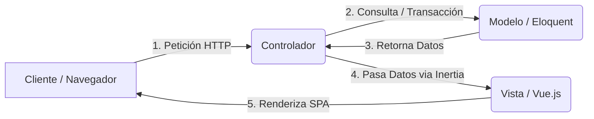

# CAPÍTULO 2: MARCO TEÓRICO

El desarrollo e implementación del Sistema de Control de Materiales e Inventarios (Asphalt-AGY) requiere la delimitación y fundamentación de los conceptos tecnológicos y científicos que sustentan su arquitectura y lógica de negocio. En este capítulo, se expone el marco doctrinal técnico correspondiente a la pila de desarrollo seleccionada (Laravel 12, Inertia.js, Vue.js 3 y Tailwind CSS) y el fundamento operativo del método de control Físico de Inventarios PEPS (Primero en Entrar, Primero en Salir).

---

## 2.1. Laravel 12 y la Arquitectura Modelo-Vista-Controlador (MVC)

### 2.1.1. Framework Laravel 12
Laravel es un framework de desarrollo de aplicaciones web de código abierto escrito en PHP, creado por Taylor Otwell, diseñado bajo una filosofía de código elegante y expresivo. La versión 12 de Laravel consolida el soporte para tipado estático nativo avanzado en PHP, optimizaciones del motor de enrutamiento y una profunda integración con herramientas modernas de construcción como Vite. Laravel proporciona un conjunto de herramientas integradas esenciales para sistemas empresariales, incluyendo control de migraciones de bases de datos, ORM para la manipulación de datos, inyección de dependencias, colas de trabajo, seguridad contra ataques comunes (como inyección SQL, CSRF y XSS) y manejo robusto de transacciones de base de datos.

### 2.1.2. Patrón de Arquitectura Modelo-Vista-Controlador (MVC)
Laravel estructura las aplicaciones siguiendo el patrón de diseño arquitectónico MVC, el cual promueve la separación de responsabilidades en tres componentes bien delimitados:



* **Modelo (Model):** Representa la estructura de datos, la lógica de negocio y las reglas de integridad de la aplicación. En Laravel, los modelos se implementan mediante el ORM **Eloquent**, el cual asocia cada tabla de la base de datos relacional con una clase orientada a objetos (Active Record). Esto facilita la interacción con los datos mediante código PHP estructurado, abstrayendo al desarrollador del lenguaje SQL directo.
* **Controlador (Controller):** Actúa como el intermediario principal y coordinador del flujo de la aplicación. Recibe las peticiones HTTP interceptadas por el enrutador, valida las entradas del usuario, interactúa con el Modelo para recuperar o persistir datos y determina qué respuesta retornar.
* **Vista (View):** Es la representación visual de los datos que se entrega al usuario final. En la arquitectura tradicional de Laravel, se gestiona mediante el motor de plantillas Blade (procesamiento del lado del servidor). Sin embargo, en el sistema Asphalt-AGY, el componente Vista se traslada al cliente mediante plantillas de componentes reactivos utilizando Vue.js 3, conectadas dinámicamente con los controladores de Laravel mediante el puente de comunicación de Inertia.js.

---

## 2.2. Vue.js 3 y la Reactividad en el Frontend

### 2.2.1. Framework Vue.js 3
Vue.js es un framework de JavaScript progresivo y de código abierto diseñado para construir interfaces de usuario e implementar Single Page Applications (SPA). Vue.js 3 introduce mejoras sustanciales en el rendimiento, un menor tamaño del archivo compilado y un sistema de reactividad renovado basado en objetos `Proxy` de ECMAScript 6, el cual permite la detección automática de cambios en el estado y la actualización ultra-rápida del DOM Virtual sin necesidad de renderizados completos de página.

### 2.2.2. Composition API y Sintaxis `<script setup>`
Vue.js 3 introduce la **Composition API** como una alternativa escalable frente al Options API tradicional. La Composition API organiza el código de los componentes en torno a su funcionalidad lógica y no a sus propiedades estructurales (data, methods, computed, etc.), facilitando la reutilización del estado y el mantenimiento de componentes de alta complejidad.

El sistema implementa la sintaxis **`<script setup>`**, un azúcar sintáctico de compilación que optimiza el uso de la Composition API. Entre sus características principales se destacan:
* **Menor código redundante (Boilerplate):** Las variables, funciones y componentes importados dentro de `<script setup>` están expuestos directamente a la plantilla del componente Vue sin requerir declaraciones explícitas de retorno (`return`).
* **Mejor rendimiento en ejecución:** El compilador de Vue pre-analiza el código del script y optimiza la reactividad de las variables en tiempo de compilación.
* **Tipado estático seguro:** Facilita la declaración de propiedades (`defineProps`) y emisiones (`defineEmits`) de forma clara y nativa en el frontend.

### 2.2.3. Reactividad en Vue.js 3
La reactividad se define como el mecanismo mediante el cual el framework detecta cambios en las variables del estado y propaga inmediatamente dichas modificaciones en la interfaz de usuario. Vue 3 proporciona dos métodos principales para declarar el estado reactivo:
* **`ref()`:** Permite envolver valores primitivos (números, cadenas, booleanos) y objetos complejos dentro de una referencia reactiva reactivando el Virtual DOM al modificarse su propiedad interna `.value`.
* **`reactive()`:** Crea una referencia reactiva exclusiva para objetos y colecciones complejas sin requerir el envoltorio de `.value`.

---

## 2.3. Inertia.js como Puente de Comunicación Monolítico

### 2.3.1. El Concepto del Monolito Moderno
Inertia.js es una biblioteca que permite crear Single Page Applications (SPA) reactivas del lado del cliente utilizando frameworks tradicionales de renderizado del lado del servidor (como Laravel). Inertia elimina la complejidad asociada al desarrollo tradicional de SPAs, las cuales suelen requerir:
* La construcción y mantenimiento de una API RESTful o GraphQL en el backend.
* El manejo de tokens de autenticación (JWT o similares).
* El desarrollo de un cliente de peticiones HTTP (Axios/Fetch) complejo.
* La duplicidad de sistemas de enrutamiento (tanto en Laravel como en Vue Router).

Inertia.js actúa como el puente de comunicación de un "Monolito Moderno". El enrutamiento y la lógica de controladores se mantienen al 100% en Laravel. Cuando un usuario interactúa con la aplicación (por ejemplo, navegando a través de enlaces provistos por Inertia), Inertia intercepta la petición HTTP estándar y realiza una llamada asíncrona via AJAX/XHR. El backend de Laravel, al detectar esta llamada de Inertia, retorna un objeto JSON especial en lugar de una página HTML completa. Dicho JSON contiene los datos necesarios de la base de datos mapeados como propiedades (`props`) y el nombre del componente Vue correspondiente. Inertia recibe estos datos y reemplaza el componente actual en el navegador del usuario en tiempo real.

```
[Navegador / Vue.js] 
        |
        +-- Petición XHR (interceptada por Inertia) --> [Laravel 12 / Controller]
        |                                                           |
        <-- Retorna JSON con Component + Props (Inertia) -----------+
```

Este proceso mantiene las ventajas de velocidad de carga y fluidez interactiva de una SPA en el navegador de la planta de asfalto, conservando la alta productividad de desarrollo y seguridad centralizada de un monolito backend tradicional.

---

## 2.4. Tailwind CSS y el Diseño Basado en Clases de Utilidad

### 2.4.1. Framework Tailwind CSS
Tailwind CSS es un framework CSS del tipo "utility-first" (basado en utilidades) de bajo nivel. A diferencia de frameworks CSS tradicionales como Bootstrap o Bulma, que proveen componentes pre-diseñados rígidos (como botones, menús de navegación o tarjetas de información), Tailwind proporciona miles de clases atómicas de utilidad (ej. `flex`, `pt-4`, `text-center`, `bg-gray-800`, `rounded-lg`) que pueden combinarse directamente en el código HTML de las plantillas para construir interfaces personalizadas y responsivas sin requerir la escritura manual de hojas de estilo CSS.

### 2.4.2. Compilación y Purga Eficiente
Tailwind CSS utiliza un proceso de compilación basado en PostCSS y Vite. Durante la fase de construcción, el compilador escanea todo el código fuente de los componentes de Vue.js y detecta las clases que están siendo utilizadas activamente. El resto de las clases del framework son descartadas mediante una técnica de purga ("Purging"). Esto asegura que el archivo CSS compilado final que se carga en la intranet local de la Planta de Asfalto sea extremadamente ligero (habitualmente menor a 50 KB), optimizando los tiempos de transferencia de datos en la red local.

### 2.4.3. Diseño Responsivo y Personalización
Tailwind facilita el diseño responsivo nativo mediante el uso de modificadores de prefijo para puntos de interrupción estándar de resolución de pantalla (`sm:`, `md:`, `lg:`, `xl:`, `2xl:`). De esta forma, el programador define de forma intuitiva cómo se reorganizará un panel de información en una tableta o pantalla móvil de supervisión de manera inmediata en el mismo archivo de maquetación del componente.

---

## 2.5. Método Físico de Valuación de Inventarios PEPS (Primeros en Entrar, Primeros en Salir)

### 2.5.1. Definición del Método PEPS / FIFO
El método PEPS (Primero en Entrar, Primero en Salir), internacionalmente conocido como FIFO (First In, First Out), es una técnica de valoración y flujo de inventarios basada en la premisa cronológica de que los primeros materiales o materias primas que ingresan a un almacén son los primeros que deben consumirse o despacharse.

### 2.5.2. Enfoque Físico Puro (Sin Valuación Monetaria)
En la contabilidad financiera tradicional, el método PEPS se emplea para valorizar económicamente el inventario de una empresa, determinando el costo del material vendido (debitando los costos más antiguos) y valorando las existencias finales a precios de mercado actuales. 

No obstante, en el contexto operativo de la Planta de Asfalto del GAMEA y en respuesta directa a las exigencias de auditoría gubernamental del informe UAI/ACR/001/2025, el sistema Asphalt-AGY implementa un **control físico puro del método PEPS**. Esto significa que:
1. **Ausencia de Importes Monetarios:** El sistema no almacena costos unitarios de adquisición, valores de facturas, importes de Debe/Haber financieros ni el valor total contable del inventario.
2. **Priorización Transaccional Física:** La lógica PEPS se aplica estrictamente a las **cantidades de materiales**. Cada lote de ingreso (representado por una orden de compra, ticket de balanza y cantidad física en Kg, M3 o Litros) se registra cronológicamente de forma inmutable.
3. **Flujo de Descuento de Lotes:** Al procesarse una salida de material para una obra, la aplicación busca el lote transaccional físicamente más antiguo con saldo disponible. La cantidad solicitada se debita de este lote hasta agotarlo. Si la demanda excede el saldo de dicho lote, el sistema deduce automáticamente la diferencia del lote consecutivo en orden cronológico, y así sucesivamente.

### 2.5.3. Importancia de la Trazabilidad Física
El control físico PEPS es idóneo para el manejo de insumos perecederos y materiales de construcción de la planta de asfalto por las siguientes razones:
* **Evita el Envejecimiento de Materiales:** El cemento asfáltico y los aditivos químicos poseen un tiempo de vida útil óptimo y condiciones de temperatura estrictas. Consumir secuencialmente los lotes más antiguos minimiza pérdidas por degradación o descomposición física del material.
* **Trazabilidad de Proveedores en Obras:** Vincula directamente cada consumo de mezcla asfáltica en un proyecto de pavimentación con el lote de ingreso físico de balanza de un proveedor específico. En caso de fallas estructurales o fisuras en la calzada, la Dirección de Obras Municipales puede rastrear inmediatamente qué proveedor y orden de compra suministró los agregados o el asfalto empleados en dicha obra.
* **Control Preciso de Mermas Físicas:** Al monitorear lotes físicos individuales, el responsable de planta puede conciliar la diferencia entre la cantidad comprada ingresada por balanza y la cantidad realmente despachada a obra, calculando la merma física real por evaporación de humedad (en agregados) o enfriamiento (en bitumen).
