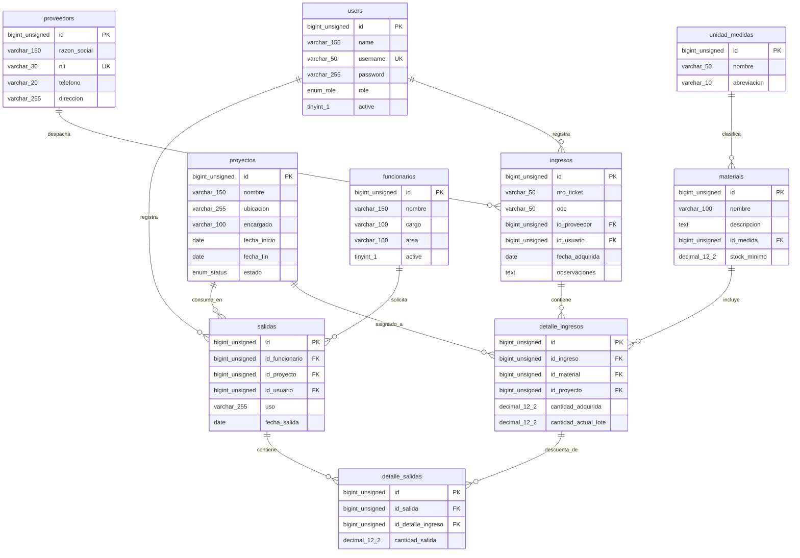

# CAPÍTULO 4: DISEÑO DE LA SOLUCIÓN E INGENIERÍA DE SOFTWARE

El desarrollo del sistema Asphalt-AGY se fundamenta en un proceso de diseño riguroso que traduce los requisitos especificados en estructuras técnicas de datos, flujos arquitectónicos y algoritmos lógicos robustos. En este capítulo, se presenta el diseño lógico y físico de la base de datos (incluyendo el diccionario de datos y el Diagrama Entidad-Relación), el diseño de la arquitectura de software monolítica adaptada y la especificación algorítmica detallada para el control físico PEPS.

---

## 4.1. Diseño de la Base de Datos

La persistencia de datos del sistema Asphalt-AGY se gestiona mediante una base de datos relacional MySQL estructurada bajo el motor InnoDB para asegurar la integridad referencial y el soporte nativo a transacciones seguras (`ACID`). El diseño consta de diez tablas normalizadas que modelan la seguridad, los catálogos operativos y los flujos transaccionales de almacén por lotes.

### 4.1.1. Diccionario de Datos

A continuación, se detalla la especificación técnica de cada una de las tablas del modelo físico de base de datos:

#### Tabla 1: `users` (Usuarios del Sistema)
Almacena las credenciales, estados de cuenta y roles jerárquicos del personal que accede a la aplicación.
| Campo | Tipo | Nulo | Llave | Predeterminado | Descripción |
| :--- | :--- | :--- | :--- | :--- | :--- |
| `id` | BIGINT UNSIGNED | No | PK | *Autoincrement* | Identificador único secuencial de usuario. |
| `name` | VARCHAR(155) | No | | | Nombre completo del usuario. |
| `username` | VARCHAR(50) | No | Unique | | Nombre de usuario único utilizado para el inicio de sesión. |
| `password` | VARCHAR(255) | No | | | Hash criptográfico de la contraseña (Bcrypt). |
| `role` | ENUM('administrador', 'operador', 'visor') | No | | | Rol asignado que delimita los permisos en la aplicación. |
| `active` | TINYINT(1) | No | | 1 (True) | Estado lógico de la cuenta (1: Activo, 0: Inactivo). |
| `created_at` | TIMESTAMP | Sí | | NULL | Fecha y hora de registro de la cuenta. |
| `updated_at` | TIMESTAMP | Sí | | NULL | Fecha y hora del último cambio realizado. |

#### Tabla 2: `unidad_medidas` (Unidades de Medida)
Catálogo paramétrico de las unidades físicas para la dosificación y almacenamiento.
| Campo | Tipo | Nulo | Llave | Predeterminado | Descripción |
| :--- | :--- | :--- | :--- | :--- | :--- |
| `id` | BIGINT UNSIGNED | No | PK | *Autoincrement* | Identificador de la unidad de medida. |
| `nombre` | VARCHAR(50) | No | | | Nombre descriptivo de la unidad (ej: "Metros Cúbicos"). |
| `abreviacion` | VARCHAR(10) | No | | | Abreviación estandarizada (ej: "m3", "Kg", "L"). |
| `created_at` | TIMESTAMP | Sí | | NULL | Fecha y hora de creación. |
| `updated_at` | TIMESTAMP | Sí | | NULL | Fecha y hora de modificación. |

#### Tabla 3: `materials` (Catálogo de Materiales)
Define las materias primas críticas de la planta cuyos niveles físicos de existencia deben monitorearse.
| Campo | Tipo | Nulo | Llave | Predeterminado | Descripción |
| :--- | :--- | :--- | :--- | :--- | :--- |
| `id` | BIGINT UNSIGNED | No | PK | *Autoincrement* | Identificador único del material. |
| `nombre` | VARCHAR(100) | No | | | Nombre comercial del insumo (ej: "Cemento Asfáltico"). |
| `descripcion` | TEXT | Sí | | NULL | Notas o especificaciones técnicas del material. |
| `id_medida` | BIGINT UNSIGNED | No | FK | | Referencia a `unidad_medidas.id`. |
| `stock_minimo` | DECIMAL(12,2) | No | | 0.00 | Cantidad mínima recomendada para activar la semaforización de alerta. |
| `created_at` | TIMESTAMP | Sí | | NULL | Fecha y hora de creación. |
| `updated_at` | TIMESTAMP | Sí | | NULL | Fecha y hora de modificación. |

#### Tabla 4: `proveedors` (Proveedores de Planta)
Registro de empresas legalmente adjudicadas para el suministro de materiales al GAMEA.
| Campo | Tipo | Nulo | Llave | Predeterminado | Descripción |
| :--- | :--- | :--- | :--- | :--- | :--- |
| `id` | BIGINT UNSIGNED | No | PK | *Autoincrement* | Identificador único de proveedor. |
| `razon_social` | VARCHAR(150) | No | | | Razón social o denominación legal de la empresa. |
| `nit` | VARCHAR(30) | Sí | Unique | NULL | Número de Identificación Tributaria del proveedor. |
| `telefono` | VARCHAR(20) | Sí | | NULL | Teléfono de contacto institucional. |
| `direccion` | VARCHAR(255) | Sí | | NULL | Dirección física de las oficinas o almacenes. |
| `created_at` | TIMESTAMP | Sí | | NULL | Fecha y hora de registro. |
| `updated_at` | TIMESTAMP | Sí | | NULL | Fecha y hora de modificación. |

#### Tabla 5: `proyectos` (Obras y Proyectos Municipales)
Proyectos viales autorizados y activos a los cuales se destinan físicamente los materiales.
| Campo | Tipo | Nulo | Llave | Predeterminado | Descripción |
| :--- | :--- | :--- | :--- | :--- | :--- |
| `id` | BIGINT UNSIGNED | No | PK | *Autoincrement* | Identificador único del proyecto vial. |
| `nombre` | VARCHAR(150) | No | | | Nombre oficial de la obra municipal (ej: "Renueva Vías"). |
| `ubicacion` | VARCHAR(255) | Sí | | NULL | Ubicación geográfica o distrito de intervención en El Alto. |
| `encargado` | VARCHAR(100) | Sí | | NULL | Nombre completo del Residente o Supervisor de Obra. |
| `fecha_inicio` | DATE | Sí | | NULL | Fecha oficial de inicio de obras viales. |
| `fecha_fin` | DATE | Sí | | NULL | Fecha límite programada para la conclusión de la obra. |
| `estado` | ENUM('activo', 'finalizado', 'pausado') | No | | 'activo' | Estado actual de ejecución en que se encuentra el proyecto. |
| `created_at` | TIMESTAMP | Sí | | NULL | Fecha de registro. |
| `updated_at` | TIMESTAMP | Sí | | NULL | Fecha de modificación. |

#### Tabla 6: `funcionarios` (Funcionarios Receptores)
Personal de obra responsable de recibir e iniciar el despacho de insumos en planta.
| Campo | Tipo | Nulo | Llave | Predeterminado | Descripción |
| :--- | :--- | :--- | :--- | :--- | :--- |
| `id` | BIGINT UNSIGNED | No | PK | *Autoincrement* | Identificador del funcionario. |
| `nombre` | VARCHAR(150) | No | | | Nombre completo del funcionario autorizado. |
| `cargo` | VARCHAR(100) | Sí | | NULL | Puesto laboral (ej: "Operador de Mezcladora", "Chofer"). |
| `area` | VARCHAR(100) | Sí | | NULL | Unidad administrativa a la que pertenece en el GAMEA. |
| `activo` | TINYINT(1) | No | | 1 (True) | Estado lógico de autorización (1: Habilitado, 0: Inhabilitado). |
| `created_at` | TIMESTAMP | Sí | | NULL | Fecha de creación. |
| `updated_at` | TIMESTAMP | Sí | | NULL | Fecha de modificación. |

#### Tabla 7: `ingresos` (Cabecera de Adquisiciones)
Almacena los datos globales del pesaje del camión y los documentos de control del proveedor en el ingreso.
| Campo | Tipo | Nulo | Llave | Predeterminado | Descripción |
| :--- | :--- | :--- | :--- | :--- | :--- |
| `id` | BIGINT UNSIGNED | No | PK | *Autoincrement* | Identificador del ingreso. |
| `nro_ticket` | VARCHAR(50) | Sí | | NULL | Código o número correlativo del ticket de balanza física. |
| `odc` | VARCHAR(50) | Sí | | NULL | Orden de Compra o contrato oficial adjudicado. |
| `id_proveedor` | BIGINT UNSIGNED | Sí | FK | NULL | Referencia a `proveedors.id`. |
| `id_usuario` | BIGINT UNSIGNED | No | FK | | Referencia a `users.id` (Usuario que realiza el pesaje). |
| `fecha_adquirida` | DATE | No | | | Fecha física en que se realiza la transacción de pesaje. |
| `observaciones` | TEXT | Sí | | NULL | Glosa o comentarios adicionales. |
| `created_at` | TIMESTAMP | Sí | | NULL | Fecha y hora de creación. |
| `updated_at` | TIMESTAMP | Sí | | NULL | Fecha y hora de modificación. |

#### Tabla 8: `detalle_ingresos` (Lotes PEPS por Proyecto)
Controla las cantidades físicas y saldos activos por cada lote y proyecto, sirviendo de base al PEPS.
| Campo | Tipo | Nulo | Llave | Predeterminado | Descripción |
| :--- | :--- | :--- | :--- | :--- | :--- |
| `id` | BIGINT UNSIGNED | No | PK | *Autoincrement* | Identificador del lote de ingreso. |
| `id_ingreso` | BIGINT UNSIGNED | No | FK | | Referencia a `ingresos.id` (Restricción ON DELETE CASCADE). |
| `id_material` | BIGINT UNSIGNED | No | FK | | Referencia a `materials.id`. |
| `id_proyecto` | BIGINT UNSIGNED | No | FK | | Referencia a `proyectos.id` (Proyecto al cual se asigna en ingreso). |
| `cantidad_adquirida` | DECIMAL(12,2) | No | | | Cantidad total física neta pesada originalmente. |
| `cantidad_actual_lote` | DECIMAL(12,2) | No | | | **Saldo físico disponible en lote**. Se debita con egresos. |
| `created_at` | TIMESTAMP | Sí | | NULL | Fecha de creación del lote. |
| `updated_at` | TIMESTAMP | Sí | | NULL | Fecha de modificación del saldo. |

#### Tabla 9: `salidas` (Cabecera de Consumos)
Registro maestro de los despachos de materiales autorizados para salir de la planta hacia las obras.
| Campo | Tipo | Nulo | Llave | Predeterminado | Descripción |
| :--- | :--- | :--- | :--- | :--- | :--- |
| `id` | BIGINT UNSIGNED | No | PK | *Autoincrement* | Identificador único de egreso. |
| `id_funcionario` | BIGINT UNSIGNED | No | FK | | Referencia a `funcionarios.id` (Funcionario que retira). |
| `id_proyecto` | BIGINT UNSIGNED | No | FK | | Referencia a `proyectos.id` (Obra que realiza el consumo). |
| `id_usuario` | BIGINT UNSIGNED | No | FK | | Referencia a `users.id` (Operador que registra el egreso). |
| `uso` | VARCHAR(255) | Sí | | NULL | Explicación del destino físico (ej: "Capa de rodadura Av. Pucarani"). |
| `fecha_salida` | DATE | No | | | Fecha física en que el material es despachado. |
| `created_at` | TIMESTAMP | Sí | | NULL | Fecha de creación. |
| `updated_at` | TIMESTAMP | Sí | | NULL | Fecha de modificación. |

#### Tabla 10: `detalle_salidas` (Detalle de Lotes Consumidos)
Registra la correlación exacta de qué lotes de ingreso provino la cantidad total retirada de la salida.
| Campo | Tipo | Nulo | Llave | Predeterminado | Descripción |
| :--- | :--- | :--- | :--- | :--- | :--- |
| `id` | BIGINT UNSIGNED | No | PK | *Autoincrement* | Identificador único del detalle de salida. |
| `id_salida` | BIGINT UNSIGNED | No | FK | | Referencia a `salidas.id` (Restricción ON DELETE CASCADE). |
| `id_detalle_ingreso` | BIGINT UNSIGNED | No | FK | | Referencia a `detalle_ingresos.id` (Lote físico de origen). |
| `cantidad_salida` | DECIMAL(12,2) | No | | | Cantidad física descontada de este lote específico. |
| `created_at` | TIMESTAMP | Sí | | NULL | Fecha de creación del registro. |
| `updated_at` | TIMESTAMP | Sí | | NULL | Fecha de modificación. |

---

## 4.2. Diagrama Entidad-Relación (DER)

El siguiente diagrama detalla las relaciones de integridad y la correspondencia de cardinalidad lógica entre las tablas físicas implementadas en la base de datos MySQL:



---

## 4.3. Diseño Arquitectónico y Flujo de Datos

El sistema Asphalt-AGY adopta la arquitectura del **Monolito Moderno** conectando el backend y el frontend mediante el protocolo dinámico de **Inertia.js**, eliminando la separación clásica de capas físicas e implementando el patrón Modelo-Vista-Controlador (MVC).

El flujo de información se organiza bajo las siguientes directrices y etapas:
1. **Petición del Cliente (Frontend):** El usuario interactúa con la interfaz reactiva construida en **Vue.js 3** y estilizada mediante clases atómicas de **Tailwind CSS**. Las acciones que requieren el envío o consulta de información se despachan como peticiones HTTP asíncronas (XHR) usando los componentes de enlaces de Inertia (`<Link>`) o su cliente de peticiones (`router.post`, `router.get`).
2. **Puente Middleware (Inertia.js):** El middleware de Inertia intercepta las peticiones en el cliente. Si es una navegación SPA, evita la recarga física del navegador y añade cabeceras HTTP especiales (`X-Inertia: true`) para indicarle al servidor Laravel que retorne datos JSON estructurados en lugar de páginas HTML tradicionales.
3. **Control y lógica (Backend - Laravel 12):** El enrutamiento de Laravel direcciona la petición al controlador correspondiente. El **Controlador** valida los datos, ejecuta los procesos de negocio (como el algoritmo PEPS) y manipula los datos del modelo relacional.
4. **Persistencia e Integridad (Modelo - Eloquent ORM + MySQL):** El modelo interactúa con el motor de base de datos MySQL a través de **Eloquent ORM**. Los procesos de ingresos y egresos PEPS se ejecutan protegiéndose bajo transacciones de base de datos (`Transaction`) para garantizar que la actualización de saldos múltiples de lotes sea atómica (se completan todos los pasos o ninguno).
5. **Renderizado de la Respuesta:** El controlador de Laravel finaliza retornando una respuesta de tipo `Inertia::render('NombreComponente', [ 'props' => $datos ])`. Si la petición provino de una navegación interna, Inertia intercepta la respuesta JSON y actualiza directamente las propiedades (`props`) del componente Vue actual, actualizando la interfaz mediante la reactividad en el navegador del cliente.

```
+-------------------------------------------------------------------------+
|                              Navegador (Cliente SPA)                    |
|  [ Vista: Componentes Vue 3 ] <===========> [ Estilos: Tailwind CSS ]   |
+-------------------------------------------------------------------------+
                                    ||
                 Peticiones asíncronas XHR / Inertia.js 
                                    ||
+-------------------------------------------------------------------------+
|                       Servidor de Aplicaciones (Laravel 12)             |
|   [ Rutas / Middleware ] ===> [ Controladores ] ===> [ Modelos ORM ]    |
+-------------------------------------------------------------------------+
                                    ||
                             Eloquent ORM (SQL)
                                    ||
+-------------------------------------------------------------------------+
|                          Persistencia de Datos (MySQL)                  |
|                         [ Base de Datos Relacional ]                    |
+-------------------------------------------------------------------------+
```

---

## 4.4. Diseño Detallado del Algoritmo PEPS

El núcleo lógico del sistema Asphalt-AGY reside en el algoritmo que procesa los egresos físicos de existencias. El algoritmo debe garantizar de forma ineludible que las cantidades de materiales retiradas se debiten secuencialmente de los lotes cronológicamente más antiguos disponibles.

### 4.4.1. Lógica del Descuento PEPS
Al procesar una salida de almacén por una cantidad física $Q_{salida}$ de un material $M$:
1. Se inicia una transacción de base de datos.
2. Se realiza una consulta ordenando ascendentemente por fecha de adquisición e identificador los lotes activos de `detalle_ingresos` donde `cantidad_actual_lote` sea mayor a cero para dicho material.
3. Se itera secuencialmente sobre cada lote activo:
   * Si la cantidad requerida restante $Q_{restante}$ es menor o igual al saldo físico del lote actual, se resta la cantidad del lote, se registra la salida parcial asociada y se detiene el proceso (finalizando con $Q_{restante} = 0$).
   * Si la cantidad requerida restante $Q_{restante}$ es mayor al saldo físico del lote actual, se consume la totalidad de dicho lote reduciendo su saldo a cero, se registra el descuento correspondiente y se actualiza $Q_{restante} = Q_{restante} - SaldoLote$, pasando al siguiente lote más antiguo en la iteración.
4. Si la iteración concluye y el stock disponible no logra cubrir la solicitud ($Q_{restante} > 0$), se cancela inmediatamente toda la transacción (efectuando un `ROLLBACK`) y se reporta error de stock insuficiente al operador, protegiendo la consistencia física de los saldos.

### 4.4.2. Pseudocódigo del Algoritmo (Backend Laravel)

A continuación, se detalla la lógica formal de la transacción en lenguaje PHP bajo las convenciones de Laravel 12:

```php
Algoritmo: RegistrarEgresoPEPS
Entradas: 
    id_material    : Entero Grande
    id_proyecto    : Entero Grande
    id_funcionario : Entero Grande
    cantidad_salida: Decimal (Cantidad física a retirar)
    uso_detallado  : Cadena
    fecha_egreso   : Fecha

Inicio
    // 1. Validar que la cantidad física sea un valor positivo
    Si cantidad_salida <= 0 Entonces
        Retornar Error("La cantidad a retirar debe ser mayor a cero.")
    FinSi

    // 2. Iniciar Transacción de Base de Datos para asegurar atomicidad (ACID)
    IniciarTransaccionBD()

    Intentar
        // 3. Obtener la suma del stock físico actual de todos los lotes para validar viabilidad
        stock_total_disponible = ConsultarStockFisicoTotal(id_material)

        Si stock_total_disponible < cantidad_salida Entonces
            // Cancelar transacción por saldo insuficiente
            CancelarTransaccionBD()
            Retornar Error("Stock insuficiente. Disponible: " + stock_total_disponible)
        FinSi

        // 4. Registrar la cabecera de la salida (Maestro)
        salida = NuevaSalida()
        salida.id_funcionario = id_funcionario
        salida.id_proyecto    = id_proyecto
        salida.id_usuario     = ObtenerUsuarioAutenticadoId()
        salida.uso            = uso_detallado
        salida.fecha_salida   = fecha_egreso
        salida.Guardar()

        cantidad_restante = cantidad_salida

        // 5. Recuperar lotes cronológicos de ingreso activos (PEPS)
        lotes_ingreso = ConsultarLotesPEPS(id_material) 
        // Consulta SQL interna: 
        // SELECT * FROM detalle_ingresos 
        // WHERE id_material = id_material AND cantidad_actual_lote > 0 
        // ORDER BY created_at ASC, id ASC;

        // 6. Iterar y realizar deducción secuencial de lotes
        Para Cada lote en lotes_ingreso Hacer
            Si cantidad_restante <= 0 Entonces
                RomperBucle()
            FinSi

            saldo_lote_actual = lote.cantidad_actual_lote

            Si saldo_lote_actual >= cantidad_restante Entonces
                // El lote tiene suficiente stock para cubrir el saldo restante
                lote.cantidad_actual_lote = saldo_lote_actual - cantidad_restante
                lote.Guardar()

                // Registrar el detalle del lote consumido
                detalle_salida = NuevoDetalleSalida()
                detalle_salida.id_salida             = salida.id
                detalle_salida.id_detalle_ingreso   = lote.id
                detalle_salida.cantidad_salida       = cantidad_restante
                detalle_salida.Guardar()

                cantidad_restante = 0
            Sino
                // El lote no cubre el total, se consume completamente y se continúa
                lote.cantidad_actual_lote = 0
                lote.Guardar()

                // Registrar el detalle del lote consumido por la fracción disponible
                detalle_salida = NuevoDetalleSalida()
                detalle_salida.id_salida             = salida.id
                detalle_salida.id_detalle_ingreso   = lote.id
                detalle_salida.cantidad_salida       = saldo_lote_actual
                detalle_salida.Guardar()

                cantidad_restante = cantidad_restante - saldo_lote_actual
            FinSi
        FinPara

        // 7. Si queda un saldo remanente no cubierto (condición de salvaguarda física)
        Si cantidad_restante > 0 Entonces
            CancelarTransaccionBD()
            Retornar Error("Error de consistencia. El stock no pudo cubrirse en los lotes.")
        FinSi

        // 8. Confirmar los cambios físicos en la base de datos de manera definitiva
        ConfirmarTransaccionBD()
        Retornar Exito("Despacho registrado correctamente bajo lógica PEPS.")

    CapturarExcepcion(Error)
        // En caso de cualquier falla de red o error de base de datos, revertir cambios
        CancelarTransaccionBD()
        Retornar Error("Falla transaccional: " + Error.Mensaje)
    FinIntentar
Fin
```

---

## 4.5. Diseño de Interfaces de Usuario (UI/UX) e Identidad Visual

Para garantizar la usabilidad en el entorno industrial de la Planta de Asfalto del GAMEA (donde existen condiciones variables de luminosidad, presencia de polvo y uso de terminales locales por operadores), se ha diseñado una interfaz web optimizada con base en una paleta de colores oscuros de alto contraste y una distribución modular de la información.

### 4.5.1. Paleta de Colores Oficial y Guía de Estilos
La interfaz implementa Tailwind CSS bajo las siguientes especificaciones cromáticas:
* **Fondo Base de la Aplicación (`#111417`):** Gris oscuro profundo/casi negro. Este tono minimiza la fatiga ocular del personal durante jornadas extensas y reduce el reflejo en pantallas expuestas a la luz exterior.
* **Superficie de Tarjetas y Componentes (`#1b1e22`):** Gris antracita de elevación visual superior. Utilizado en contenedores, formularios y paneles de control, permitiendo separar visualmente las secciones.
* **Color Primario / Naranja de Seguridad (`#f27b00`):** Tono de acento vibrante e industrial (naranja de seguridad vial). Empleado en botones de acción principal, elementos activos del menú lateral, bordes de enfoque de campos de texto y micro-interacciones.
* **Texto de Contenido (`#e1e6eb`):** Blanco hueso de alta legibilidad, garantizando un ratio de contraste adecuado sobre los fondos oscuros según las directrices WCAG 2.1.
* **Estados de Alerta Semaforizados (Control de Stock):**
  * *Stock Óptimo (Verde / `#10b981`):* Indica que la cantidad física acumulada supera holgadamente el stock mínimo.
  * *Punto de Reorden (Amarillo-Naranja / `#f59e0b`):* Alerta preventiva indicando que el saldo físico está cerca del stock mínimo de seguridad.
  * *Stock Crítico / Agotado (Rojo / `#ef4444`):* Alerta de quiebre de stock que requiere una Orden de Compra urgente para evitar la parada de la planta.

### 4.5.2. Distribución del Dashboard (Bento Grid)
La pantalla principal (Dashboard) utiliza una distribución del tipo **Bento Grid** (rejilla asimétrica basada en columnas CSS Grid de Tailwind). Esto organiza los datos clave de la planta de asfalto en tarjetas auto-contenidas y jerarquizadas:

1. **Tarjeta de Monitoreo de Stock Crítico (Grande - 2/3 de ancho):** Gráfico interactivo y visual de barras horizontales que contrasta el stock físico actual contra el stock mínimo de seguridad del cemento asfáltico, asfalto en frío y agregados principales.
2. **Tarjeta de Alertas de Reposición (Mediana - 1/3 de ancho):** Listado dinámico de materiales que requieren compra urgente por haber alcanzado o superado el stock mínimo (resaltados en rojo `#ef4444`).
3. **Tarjeta de Resumen Diario de Balanza (Larga - Ancho Completo):** Tabla compacta que muestra los últimos ingresos registrados en el día (placa de camión, ticket de balanza, material y peso neto).
4. **Tarjeta de Distribución por Proyecto (Larga - Ancho Completo):** Visualización analítica rápida de las salidas PEPS asociadas a cada proyecto vial activo en la jornada.
5. **Tarjetas de Indicadores KPI (Pequeñas - Fila Superior):** Bloques numéricos compactos de alto impacto que consolidan:
   * Total de toneladas de material ingresado hoy.
   * Total de metros cúbicos y kilogramos despachados.
   * Cantidad de camiones proveedores procesados en balanza.

Esta estructura visual simplifica la toma de decisiones críticas para el Jefe de Planta y el personal técnico de balanza del GAMEA.

